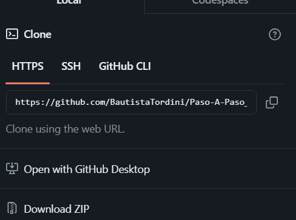

# Guía de Instalación de OptiFine y Mods en Minecraft con TLauncher Para el Servidor

## 1. Descargar TLauncher

1. **Ir a la página oficial de TLauncher:**
   - [Descargar TLauncher](https://tlauncher.org/en/)

2. **Crear una cuenta en TLauncher:**
   - Haz clic en "Sign Up" en la esquina superior derecha.
   - Completa el formulario de registro con tu correo electrónico, nombre de usuario y contraseña.
   - Verifica tu cuenta a través del enlace enviado a tu correo electrónico.

3. **Instalar TLauncher:**
   - Descarga el instalador para tu sistema operativo (Windows, macOS o Linux).
   - Ejecuta el instalador y sigue las instrucciones en pantalla para completar la instalación.

## 2. Instalar OptiFine y Mods

1. **Abrir TLauncher:**
   - Inicia TLauncher y accede con tu cuenta recién creada.

2. **Seleccionar la versión de Minecraft con OptiFine:**
   - En la pantalla principal de TLauncher, busca la versión de Minecraft que deseas jugar.
   - Haz clic en el botón de versión y selecciona una versión que tenga OptiFine integrado SOLO 1.20.1 tal como aparece en la imagen.
    

3. **Acceder a la carpeta de mods:**

   - Una vez dentro ir a la seccion Mods.
   

   - Haz clic en "Carpeta de Mods" para acceder a la carpeta .minecraft/mods.
   - Asegura estar dentro de la ruta correcta, en mi caso es: C:\Users\bauti\AppData\Roaming\.minecraft\mods

   

4. **Colocar los mods en la carpeta:**
   - Descarga los mods que estan en este repositorio (CLICK EN DOWNLOAD ZIP).
   

   - Corta (Ctrl + X) los archivos .jar de los mods descargados en el zip y pégalos (Ctrl + V) en la carpeta "mods", tiene que quedar tal cual como en la imagen.

   

## 3. Configurar un Servidor en Minecraft

1. **Seleccionar la opción Multijugador:**
   - Vuelve al inicio.
   - En el menú principal, selecciona "Multijugador".

   

2. **Añadir un nuevo servidor:**
   - Haz clic en "Añadir servidor".
   - Ingresa la IP del servidor proporcionada en el campo correspondiente.
   - Haz clic en "Hecho".

   
   

3. **Editar la IP del servidor:**
   - Cada vez que la IP del servidor cambie, selecciona el servidor en la lista y haz clic en "Editar".
   - Actualiza la IP del servidor y haz clic en "Hecho".

   

4. **Jugar:**
   - Darle doble click al servidor cargado y a jugar putos.

